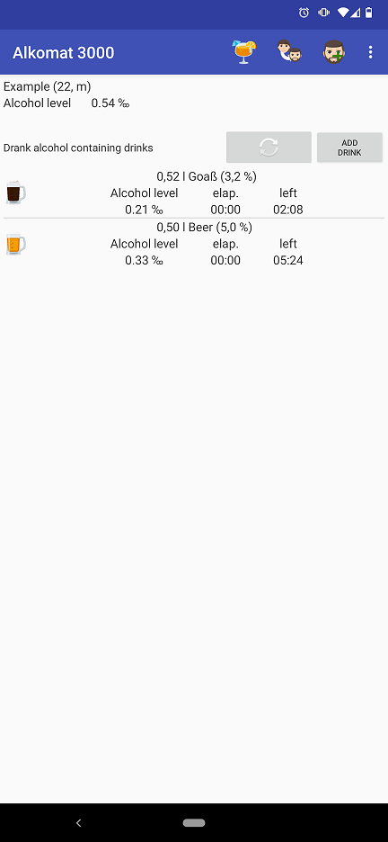
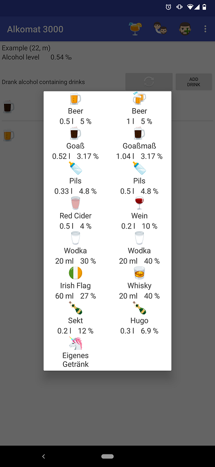

# Alkomat 3000




### Installing the app
Download the [app as .apk](https://github.com/dieechtenilente/alcoholtestapp/releases) and copy it to your android phone.
Open the file browser and navigate to the apk file. To install it, click on it and accept the warning. Enjoy the app :)

### Fork & Clone the repo
If you haven't already, fork [this repo](https://github.com/dieechtenilente/alcoholtestapp/fork).

#### Android Studio
Clone the **alcoholtestapp app** in Android Studio:

1. Choose **VCS > Checkout from Version Control > GitHub** on the main menu.
2. From the **Repository** drop-down list, select the source repository to clone the data from.
3. In the **Folder** text box, specify the directory where the local repository for cloned sources will be set up.
4. Click the Clone button to start cloning the sources from the specified remote repository.

#### Command line Git
[Clone the alcoholtestapp](https://help.github.com/articles/fork-a-repo#step-2-clone-your-fork)

Open your terminal, navigate to your working directory, use `git clone` to get a local copy of the repo.

```
# Clones your fork of the repository into the current directory in terminal
$ git clone https://github.com/YOUR-USERNAME/alcoholtestapp.git
```

### Configure remote upstream for your fork
To sync changes you make in a fork with this repository, you must configure a remote that points to the upstream repository in Git.

- Open a terminal or command prompt
- List the current configured remote repository for your fork

```
$ git remote -v
origin	https://github.com/YOUR_USERNAME/alcoholtestapp.git (fetch)
origin	https://github.com/YOUR_USERNAME/alcoholtestapp.git (push)
```

- Specify a new remote upstream repository

```
$ git remote add upstream https://github.com/dieechtenilente/alcoholtestapp.git
```

- Verify the new upstream repository

```
$ git remote -v

origin	https://github.com/YOUR_USERNAME/alcoholtestapp.git (fetch)
origin	https://github.com/YOUR_USERNAME/alcoholtestapp.git (push)
upstream https://github.com/dieechtenilente/alcoholtestapp.git (fetch)
upstream https://github.com/dieechtenilente/alcoholtestapp.git (push)
```

#### Sync your fork
Once you have set up a remote upstream, you can keep your fork up to date with our repository by syncing your fork.

- Open a terminal or command prompt
- Change to the current working directory of your local repository
- Fetch the branches and commits from the upstream repository.  Commits to `master` will be stored in a local branch, `upstream/master`.

```
$ git fetch upstream
```

- Check out your forks local `master` branch

```
$ git checkout master
```

- Merge changes from `upstream/master` into  your local `master` branch which syncs your forks `master` branch with our repository.

```
$ git merge upstream/master
```

#### Import Gradle project into Android Studio
Once the project is cloned to disk you can import into Android Studio:

* From the toolbar select **File > Import Project**, or **Import Non-Android Studio project** from the Welcome Quick Start.
* Navigate to the root project folder, **alcoholtestapp** directory and click **OK**

### Build the feedback server

The feedback server is used by the feedback feature in the app, which allows users to
send a message and general device diagnostics to the developer. It is an HTTPS server
written in [Go](https://golang.org/). It takes messages in JSON (see [below](https://github.com/dieechtenilente/alcoholtestapp#feedback) for the format) and forwards them to the specified e-mail address.

First, install the `gomail` package to compile the feedback server.

```
go get gopkg.in/gomail.v1
```

You need a new file called `config.go` in the `feedback` directory. The file is .gitignored
since it holds the password for the feedback server's mail account.

```go
package main

const (
        // address of the feedback bot
        FromAddr = "foo@bar.de"

        // Password of the feedback bot
        Passwd = "secretpassword"

        // SMTP server of the feedback bot
        SMTPSrv = "smtp-mail.bar.com"
        SMTPPort = "587"

        // your mail address
        ToAddr = "cryonme@nobodycares.com"

        // default subject line; fixed at the moment
        Subject = "Alkomat 3000 Feedback"

        // port used by this server (should be the same as used in the app)
        Port = "9444"

        CertificatePath = "certificate.pem"
        PrivateKeyPath = "privatekey.pem"

)
```

## App structure

### Terminology

|term|description|
|----|-----------|
|`User`| Can consume `Mixture`s as `Drink`s which are stored in a `Drink`-Array|
|`Drink`|A consumed `Mixture` with additional data (time of consume, ...)|
|`Mixture`|A `Mixture` has one or more `Content`s and can be consumed by a `User`|
|`Content`|A base content of a `Mixture` (e.g. beer, vodka, water, ...)|

### Data saved by the app on your phone

Path: `/data/data/de.klaushackner.breathalyzer/shared_prefs/data.xml`

#### Users-Array

An array with every user currently existing including its drinks (updated on startup/resume/refresh button press)

```javascript
[
  {
    name:String,
    isMale:boolean,
    age:int,
    weight:int,
    height:int,
    created:long,
    drinks: [
      {
        name:String,
        description:String,
        consumePoint:long,
        mixtureImage:String,
        content: [
          {
            name:String,
            alcContent:double,
            amount:double
          }
        ]
      }
    ]
    depletedDrinks: [
      {
        name:String,
        description:String,
        consumePoint:long,
        mixtureImage:String,
        content: [
          {
            name:String,
            alcContent:double,
            amount:double
          }
        ]
      }
    ]
  }
]
```

In addition to that: `lastUser` as `long` (simply the creation date (with milliseconds)) from the last selected user


#### Recipe-Array

`MixtureImage` represents a image (as string). See [source](https://github.com/dieechtenilente/alcoholtestapp/blob/master/app/src/main/java/de/klaushackner/breathalyzer/model/MixtureImage.java) for more information.

For custom recipes saved by the user:

```
[
  {
    name:String,
    text:String,
    imgString:String,
    ingredients:[
      {
        name:String,
        alcContent:double,
        quantity:double
      }
    ]
  }
]
```

### Send Feedback

#### Feedback

Example of the string sent by the app:

```
{
  Device:{
    OsVer:"3.0.31-novafusion(6452af36f2)",
    OsApiLvl:22,
    Device:"golden (samsung, GT-I8190)",
    Model:"GT-I8190 (cm_golden)"
   },
  AppInfo:"Friendly name: 1.1, version code: 1",
  LogTrace:"",
  Sender:"Francis alias Ajax",
  SenderMail:"foo@bar.cool",
  Message:"Hi, I have a problem! Can you help me??"
}
```

The `LogTrace` is for future use: Logging every exception into a file.

Disclaimer for the sake of the EU-GDPR

```
By pressing the "send message" button in the "Send Feedback" form you agree that the data entered above,
information about your device (manufacturer, model, operating system and its version), your current
IP-Address and the opt-in date as well as information about the app (version number, log files, stored
mixtures/recipes) will be sent securely. Data beyond the one provided by you optional (Name,
E-Mail-Address, Message) is used to ensure a better problem solving process and are stored until
revocation and are deleted after 10 years (except there are other valid lawfully retention periods).

No other personal data (photos, videos, etc.) are sent!

The name and the e-mail address are optional, but useful for inquiries/feedback.

You can always contact us via e-mail (privacy-duck@outlook.com) about your saved data and request a copy,
cancellation or rectification. In addition, you have the right to contact the data protection authority
responsible for you (for example your national data protection officer).
```

## Issues
Found a bug? Want to request a new feature?  Please let us know by submitting an issue or use the in-app feedback function (in the options menu).

## Licensing
This project stands unter the MIT-License. Bear in mind that the pictures used in this project have their own license!

## Sources/Adaptions
Readme adapted from [Esri](https://github.com/Esri/arcgis-runtime-samples-android)

[Emoji icons provided free by EmojiOne](http://emojione.com/)
